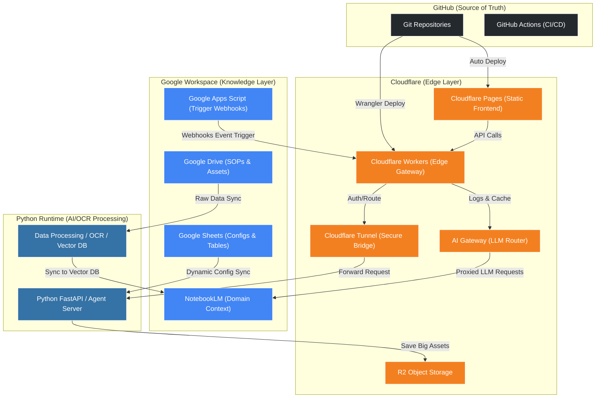

# Module 3: Integration Map (FALO 多平台整合拓撲)

本模組探討 FALO 全域架構中，四大核心體系（Cloudflare Edge Layer、GitHub Source of Truth、Google Workspace Knowledge Layer、Python AI Runtime）之間的關聯性、資料流與控制流設計。

---

## 🗺️ 全域系統拓撲圖 (Mermaid Topology)

以下為 FALO 平台三維一體的資料與控制流圖解：

---

## 🔗 四大體系協作解析

### 1. GitHub × Cloudflare (部署流)
* **唯一真理來源 (Source of Truth)**：所有的邊緣程式碼（Workers 腳本、D1 資料庫 Schema、Pages 前端網頁）皆託管於 GitHub。
* **持續部署 (CI/CD)**：
  * 當開發者或 AI 代理人 (Agent) 提交程式碼至 `main` 分支，GitHub Actions 或 Cloudflare 內建整合將自動觸發，編譯並將靜態網頁部署至 Pages，並將無伺服器腳本發布至 Workers。
  * 對於 AI 代理人動態產生的 UI，Agent 會提交 Pull Request，藉由 Cloudflare Pages 的 Branch Deploy 機制生成一個隔離的 Preview 網址，供視覺化評估。

### 2. Cloudflare Tunnel × Python (數據與控制通道)
* **邊緣到本機的安全通道**：本機 Python 伺服器不需要對公網開啟 Port，也不需要配置公網 IP，安全防禦完全交給 Cloudflare。
* **多埠路由 (Multi-port Routing)**：
  * Cloudflare Tunnel 將外部域名 `dev.formosa-ai.com` 指向 `localhost:8080` (我們的測試伺服器)。
  * 同理，將 `api.formosa-ai.com` 導向本機 Python 核心服務（`localhost:8000`）。
  * 這種設計確保邊緣 Workers 在處理完驗證 (Auth) 後，可以直接經由本機隧道將請求轉發至特定的 Python 端點。

### 3. Google Workspace × Cloudflare & Python (知識與事件觸發)
Google Workspace 作為 FALO 的 **Knowledge Layer (知識層)**，與 Python Runtime 及 Cloudflare 協同運作：

* **Google Drive (知識同步)**：
  * Drive 存放團隊的標準作業程序 (SOP) 與大型非結構化資料。
  * 本機 Python ETL 腳本定期讀取 Drive 檔案，進行向量化 (Embedding) 後，寫入本地向量資料庫，並提供給 **NotebookLM** 與本地 Agent 做為背景知識。
* **Google Sheets (組態管理)**：
  * Sheets 提供極佳的視覺化表格界面，適合團隊成員直接編修 AI Agent 的提示詞參數或路由設定檔。
  * 本機 Python API 可透過 Google Sheet API 定期讀取資料並載入記憶體，做為無程式碼 (No-code) 組態管理。
* **Google Apps Script (GAS) × Workers (事件觸發)**：
  * 當 Google Drive 檔案更新或 Sheet 表格有新變更時，GAS (Google Apps Script) 會自動觸發並發送一個 HTTP POST Webhook。
  * 該 Webhook 透過 `https://api.formosa-ai.com/webhook` 穿過 Cloudflare Edge（在 Workers 層進行簽章校驗與過濾），最後抵達本機 Python 執行特定的 AI 任務。

---

## 🤖 AI-Native 視角的整合優勢

1. **AI Gateway 作為全域大腦限流器**：  
   所有的 LLM 呼叫不論是由本機 Python Runtime 發出，還是由 Google Apps Script 發出，統一經過 Cloudflare AI Gateway。這使得 FALO 擁有全域的 Token 快取、成本監控與死循環自我防護。
2. **邊緣資料庫快取 (D1 + KV)**：  
   將常見的 Prompt 範本與使用者對話狀態快取在邊緣 D1 資料庫。當本機 Python 伺服器因硬體或網路問題短暫離線時，邊緣端 Workers 依然能讀取 D1 狀態，回傳優雅的錯誤提示或快取數據，提升用戶體驗。
