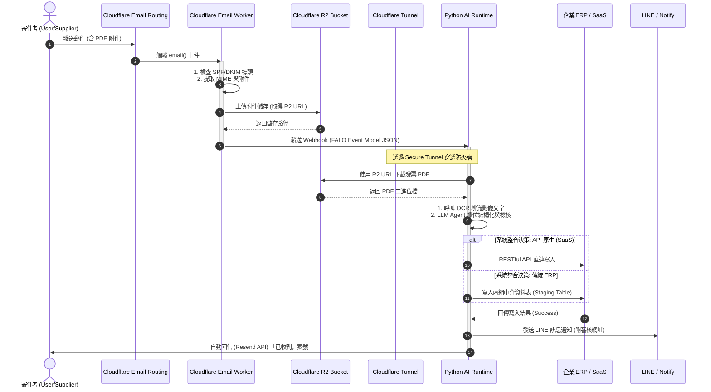

# Module 7: 教材大綱與系統藍圖

本模組彙整 FALO AI Email Platform 的系統設計圖表（使用 Mermaid.js 繪製），並為 Skyline、天心 ERP 與 FALO 提供教材大綱及培訓白皮書規劃。

---

## 1. 系統交互序列圖 (System Sequence Diagram)

以下 Mermaid 序列圖詳細呈現了從外部寄件者發送郵件，到 Cloudflare Edge 解析、R2 儲存、Python AI Runtime 處理、最終寫入 ERP 與發送 LINE 通知的完整交互流程：



---

## 2. 培訓教材與白皮書規劃

為協助企業、SaaS 生態圈夥伴及 IT 人員快速掌握 FALO AI Email Platform，我們設計了三套不同版本的教材藍圖：

### 📘 版本 A：FALO 官方白皮書與技術標準版
- **目標受眾**：FALO 架構師、雲端工程師、合作夥伴開發者。
- **教學重點**：
  1. **標準 Event Model 設計規範**：如何擴充 Event Schema 以適應 Slack, Webhook, File Drop。
  2. **Cloudflare Workers 進階開發**：流式解析（Streaming parsing）、邊緣安全（Cloudflare Zero Trust Access）與 API 憑證託管。
  3. **Python AI Runtime 優化**：OCR 模型微調（Fine-tuning）、LLM Agent 提示詞防禦（Prompt Injection Defense）與長異步任務管理（Celery / Redis Queue）。

### 📙 版本 B：Skyline / 現代 SaaS 系統整合版
- **目標受眾**：SaaS 平台產品經理、系統架構師、API 合作夥伴。
- **教學重點**：
  1. **別名帳戶池管理**：如何透過 Cloudflare API 自動化為 SaaS 用戶生成、回收 `user_xxxx@saas.com` 電子郵件別名。
  2. **多租戶隔離與計費模式**：計算每個 Tenant 消耗的 Edge 流量與 AI Tokens，建立精準的計費後台。
  3. **UI 結合最佳實踐**：如何在 SaaS 前端展示「AI 解析狀態」，並與 Gmail 草稿匣進行 Human-in-the-loop 的對接。

### 📗 版本 C：傳統企業 / 天心 ERP 實戰無痛升級版
- **目標受眾**：傳統企業 IT 主管、MIS 人員、ERP 系統管理員。
- **教學重點**：
  1. **非侵入式 AI 升級技術**：為什麼不需修改 ERP 代碼，即可透過「讀信」完成資料輸入自動化。
  2. **中介資料表 (Staging Table) 對接 SOP**：
     - 如何設計 SQL Server / Oracle 中的中介表欄位。
     - 安全地限制 Python API 的資料庫寫入權限（僅能寫入 Staging，不能直接修改核心 Account Ledger）。
     - 設計自動對帳（Reconciliation）與防重入（Idempotency）機制，防止同一封 Email 重複寫入。
  3. **LINE Notify 整合教學**：MIS 如何快速申請 LINE Notify Token，並在本地 Python 腳本中呼叫發送通知。

---

## 3. 教材文件結構大綱 (Markdown & HTML)

所有培訓文件將包裝為以下結構，便於網頁部署與列印：

```
📁 falo-email-platform-training/
├── 📄 01_Executive_Summary.md      # 決策者導讀：Email 2.0 商業價值與 ROI
├── 📄 02_Architecture_Deep_Dive.md # 技術架構深探：從 Edge 到 Local Runtime
├── 📄 03_CF_Setup_Guide.md         # Cloudflare 設定指南：DNS、Routing 與 Worker 部署
├── 📄 04_Python_Runtime_Guide.md   # Python 接收端設置：FastAPI 與 OCR 模組配置
├── 📄 05_ERP_Integration_SOP.md    # 企業 ERP 整合實戰：中介表與 API 連線規範
└── 📁 assets/                      # 教學圖、架構圖、Mermaid 原始檔
```
