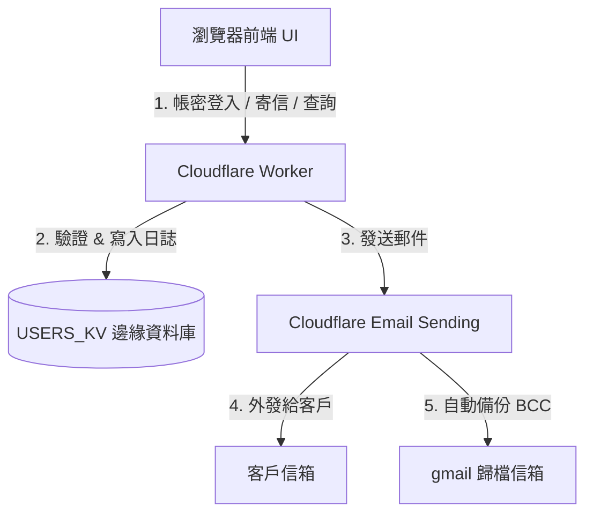

# Chapter 09: FALO Edge 發信門戶與動作審計模組 (Edge Email Portal & Activity Audit)

本章將引導學員與企業客戶了解如何利用 Cloudflare Workers 與 KV 邊緣資料庫，建置一個**具備權限控管、多發信角色切換、以及動作審計日誌 (Audit Trail)** 的 Edge Web 發信平台。這適合作為 AI 教學與顧問演示（Demo）的實務案例。

---

## 📌 1. 商業痛點與設計背景

在企業環境中，電子郵件外發管理通常面臨以下挑戰：
1. **SMTP 被阻擋**：許多雲端伺服器或公司防火牆會阻擋對外的 Port 25/465/587，導致程式無法寄信。
2. **缺乏發信審計**：員工以共用信箱寄信給客戶時，管理員無法追蹤是「誰」在「什麼時間」、「從哪個 IP」發了這封信。
3. **網域信譽風險**：未受控的發信管道容易被濫用寄送垃圾信，導致企業網域被 Gmail 或 Outlook 列入黑名單。

---

## 🛠️ 2. 邊緣計算解決方案 (Architecture)

本模組完全運行於 **Cloudflare 邊緣網路**，具備無伺服器 (Serverless)、高安全、零維護成本的優勢：



### 系統核心組件：
1. **Glassmorphism SPA 前端**：單頁 Web 介面，支援行動端自適應。
2. **權限分級制**：
   * **超級管理員 (`force`)**：解鎖「發信」、「帳密管理」與「動作審計日誌」三大面板。
   * **普通使用者**：僅限使用「發信」功能，其餘管理介面皆處於安全隔離狀態。
3. **動態審計 (Audit Logs)**：每一次操作（登入、發信、管理員帳號增刪）均會即時擷取台北時間、使用者、動作類型、客戶端 IP，並持久化寫入 KV 資料庫。

---

## ⚙️ 3. 核心程式碼實作

### A. 設定檔 `wrangler.toml`
綁定發信服務與 KV 命名空間：
```toml
name = "falo-email-portal"
main = "index.js"
compatibility_date = "2026-06-29"

[observability]
enabled = true

[[kv_namespaces]]
binding = "USERS_KV"
id = "b08cae3fdde5415ba8cf206985060cf5"

[[send_email]]
name = "EMAIL"
```

### B. 後端 API 與日誌寫入 (部分程式碼)
在後端邏輯中，我們定義了 `logAction` 方法，在每一次 API 調用時記錄行為：
```javascript
async function logAction(env, username, action, ip, details) {
  const timestamp = new Date().toISOString();
  const logKey = `log:${timestamp}`;
  const logData = { timestamp, username, action, ip, details };
  // 儲存日誌，並設定 7 天過期以防資源堆積
  await env.USERS_KV.put(logKey, JSON.stringify(logData), { expirationTtl: 604800 });
}
```

---

## 🎯 4. 顧問教學與演示步驟 (Demo Scenario)

在向客戶或學生演示此系統時，可遵循以下情境：

1. **超級管理員登入**：
   * 使用預設超級管理員帳密（`force` / `0922764763`）登入。
   * 展示「帳密管理」與「動作日誌」面板，說明超級管理員擁有的最高權限。
2. **動態建立普通帳號**：
   * 在「帳密管理」新增一個使用者 `sales_agent`。
   * 系統會自動記錄日誌，並對密碼進行 SHA-256 加密儲存。
3. **權限隔離展示**：
   * 登出 `force`，改以 `sales_agent` 登入。
   * 展示介面上的「帳密管理」與「動作日誌」已被完全隱藏，API 也已從後端阻斷。
4. **安全發信與動作追蹤**：
   * 以 `sales_agent` 身分發送一封郵件。
   * 重新以 `force` 登入，進入「動作日誌」檢視：可以清楚看到 `sales_agent` 在何時、從哪個 IP、發信給了誰、主旨為何。
