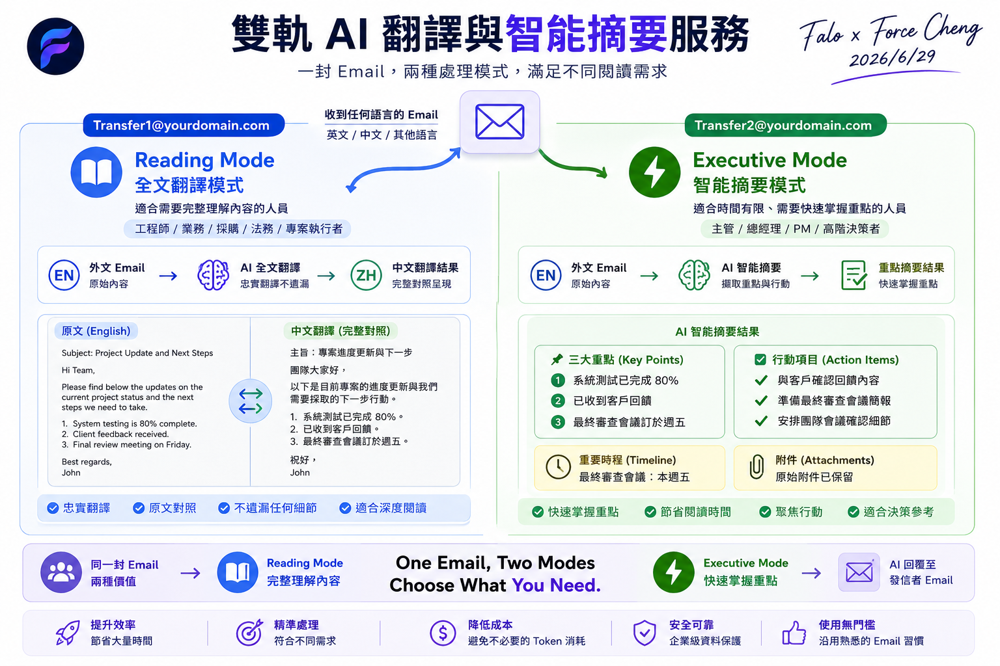

# 雙軌 AI 翻譯與智能摘要服務 (Dual-Track AI Translation & Summarization Services)

本專案的核心是一個**基於郵件服務驅動的自動化 AI 回覆網關**。使用者只需透過任意標準電子郵件客戶端寄送郵件，系統便會在背景自動調用 AI 大語言模型進行語意分析與處理，並於數秒內將 AI 分析結果自動回覆給使用者（在本案例中，提供「忠實全文翻譯」與「智能摘要與行動項提煉」兩大自動回覆服務）。全程無需改變使用者原有的郵件習慣，實現無感、即時的 AI Native 流程。


> 📌 **系統運作流程圖說明**：如上圖所示，使用者發送的郵件透過邊緣網關，依據不同的 AI 郵件角色（`translate@` 或 `translate2@`）進行分流路由與智能回覆。當網關偵測到重複翻譯請求時（如將中文郵件發送至全文翻譯信箱），則透過非 AI 的預防機制直接拒絕並秒級回信，以達到零 Token 算力浪費的安全控制目標。

---

## 📌 商業痛點與設計背景

在跨國商務或多語系企業協作中，郵件的翻譯與閱讀常面臨以下瓶頸：
* **閱讀疲勞與時間浪費**：高階主管通常沒有時間閱讀數千字的長篇外文郵件，他們需要在 3 秒內快速掌握「3 大核心重點」與「有何待辦事項 (Action Items)」。
* **算力與成本浪費 (Token Abuse)**：如果信件本身已是中文，使用者仍將其發送給翻譯 AI，會白白耗費伺服器 GPU 算力與 Token 費用。
* **長信件輸出截斷**：大語言模型若未經參數調優，預設輸出長度限制往往過低，導致長信件翻譯到一半便被迫中斷。

為了同時滿足**全文忠實對照翻譯**與**極速高管摘要**，同時兼顧**零算力損耗防錯**，我們設計了「雙軌 AI 別名路由機制」。

---

## 🛠️ 雙軌分流與零成本過濾架構 (Architecture)

本架構在「郵件網關層」進行動態收信別名分流，免去維護多個獨立系統的硬體與運維成本：



> 📌 **零成本過濾機制說明**：如上圖流程所示，網關預處理機制能在毫秒級速度下過濾重覆翻譯的請求。此功能不依賴任何外部 AI API 判定語系，從而在最前端截斷了對 AI 伺服器的無效調用，將 Token 浪費完全降至零。


```
[ 寄件者 Email ]
       │
       ▼
[ 郵件邊緣網關層 (FALO Edge Gateway) ]
       │
       ├─ 解析郵件純文字與偵測語系
       │
       ├─ 判斷：信件主體為中文？
       │     ├─ Yes (寄給翻譯別名) ➔ 🚫 直接退回警示通知（預處理攔截，AI Token 消耗 = 0）
       │     └─ No ➔ 繼續分流
       │
       ├── 路由 1：翻譯別名 (translate@...) ➔ 🧠 邊緣 AI：全文翻譯為繁體中文 ➔ 回信 (附加原文對照)
       └── 路由 2：摘要別名 (translate2@...) ➔ 🧠 邊緣 AI：產出繁中摘要 & 待辦行動 ➔ 回信 (附加原文對照)
```

### 雙軌別名定義：
* **`translate@` (全文翻譯別名)**：
  * **功能**：忠實全文翻譯為繁體中文，並在下方自動附加郵件原文對照。
  * **防錯過濾**：若偵測到主要內容已是中文，直接退回警示郵件，**不呼叫 AI，零算力耗損**。
* **`translate2@` (摘要別名)**：
  * **功能**：只生成繁體中文的「📌 智能摘要」與「🎯 關鍵行動/待辦事項」（不做全文翻譯），並在下方自動附加原文，中英文郵件皆支援。

---

## ⚙️ 核心設計邏輯

為了保護企業系統架構的商業機密，我們將核心代碼抽象為以下「邊緣網關預處理邏輯」，其核心目標為**防錯、省成本、保證穩定性**：

### 零成本中文偵測與阻擋邏輯 (非 AI 預處理)
在郵件抵達大模型前，邊緣網關會先執行輕量化規則判斷。若中文字元密度超過臨界點，則直接調用網關發信退件，避免調用昂貴的 AI 算力：
```
【網關預處理邏輯】
IF 收件者為 [翻譯信箱] AND 內文中文字元數量 > 10:
    記錄日誌："偵測到主要內容為中文，跳過翻譯，直接退信（零 Token 消耗）"
    直接回覆系統郵件："此信主要內容已為中文，暫不提供翻譯服務..."
    中止流程 (流程結束，AI Token 消耗 = 0)
```
### 雙軌 AI 參數調優控制
為了保障超長郵件的完整性，並防止 AI 在翻譯過程中產生多餘的幻覺解釋，我們在網關呼叫大模型時實施以下參數控制策略：
* **輸出上限控制 (Max Output Length)**：將大模型的最大輸出限制放寬，容許生成更長的中文字數，解決長信件被中途截斷的痛點。
* **創造力溫度壓制 (Low Temperature)**：將隨機度溫度調低。這能使大模型發言更嚴謹、緊扣原文，有效杜絕翻譯時產生幻覺或多餘解釋。

---

## 🎯 顧問教學與演示情境 (Demo Flow)

在為企業進行示範時，可執行以下四個驗證步驟：

* **英文全文對照翻譯 (`translate@`)**：
  * 發送一封英文長郵件至翻譯信箱。
  * **預期結果**：收到回信，頂部包含完整的繁體中文翻譯，底部包含乾淨的英文原文對照。
* **中文退信防護機制 (`translate@`)**：
  * 發送一封中文郵件至翻譯信箱。
  * **預期結果**：瞬間收到退信通知，告知暫不提供中文至中文的服務，同時確認後端日誌中完全沒有產生任何 AI 算力費，證明零成本預防機制生效。
* **高管智能摘要 (`translate2@`)**：
  * 發送一封英文或中文長郵件至摘要信箱。
  * **預期結果**：收到回信，僅包含「📌 智能摘要」與「🎯 關鍵行動/待辦事項」，不做全文翻譯，大幅節省高階主管閱讀時間。
* **多收件人群發功能**：
  * 在發信門戶中，同時向多個郵件角色群發測試信，驗證邊緣網關的群發分流能力，並在動作日誌中檢視審計明細。

---

## 📁 課堂實作範例下載 (Downloadable HTML Examples)

為了便於顧問示範與學員練習，我們在本地目錄提供了以下 4 個測試流程中所產生的 `.html` 範例信件。學員可以直接點擊在瀏覽器新分頁中開啟檢視：

* **[01_english_faithful_translation.html](examples/01_english_faithful_translation.html)**：向翻譯信箱發送**英文郵件**後，由 AI 產出的**全文忠實對照翻譯回信範例**。
* **[02_english_smart_summary.html](examples/02_english_smart_summary.html)**：向摘要信箱發送**英文郵件**後，由 AI 產出的**智能摘要與關鍵行動回信範例**。
* **[03_chinese_smart_summary.html](examples/03_chinese_smart_summary.html)**：向摘要信箱發送**中文郵件**後，由 AI 產出的**智能摘要與行動項回信範例**（中文信件亦適用摘要別名）。
* **[04_chinese_translation_blocked.html](examples/04_chinese_translation_blocked.html)**：向翻譯信箱發送**中文郵件**後，由網關預處理規則直接攔截並退回的**處理提示與警示通知範例**。
