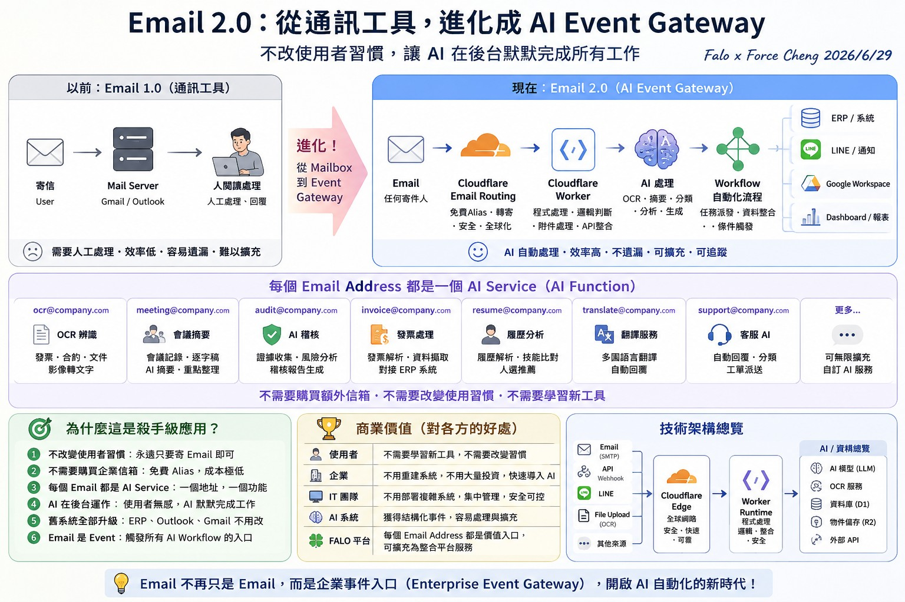

# FALO AI Email Platform (下一代企業 AI 收件與事件閘道基礎建設)

## 📌 專案願景與核心價值
**FALO AI Email Platform** 不是傳統的 Email 收發工具，也不是單純的 Cloudflare 轉寄功能，而是 **下一代 AI Native Enterprise Email Platform (企業 AI 原生郵件平台)**。

我們重新定義了 Email 的角色：**Email 不再只是通訊工具，而是「企業事件閘道」(Enterprise Event Gateway)**。

### 💡 核心設計原則
> **「不要教使用者使用 AI，而是讓 AI 去適應使用者既有的工作方式。」**
> 
> 使用者永遠只需要寄送或轉寄 Email，AI 會在背景默默完成所有的工作，將非結構化的郵件轉化為結構化的企業事件與工作流。

---

## 🎨 系統架構總覽 (Email 2.0)

以下為 FALO AI Email Platform 的全景資料流與架構設計：



### 🔄 核心資料流向 (From Email to AI Workflows)
```
[ 寄件人 Email ] (任意郵件用戶端)
       │
       ▼
[ Cloudflare Email Routing ] (免費別名 Alias / 轉寄 / 安全邊緣)
       │
       ▼
[ Cloudflare Email Workers ] (JS 邊緣運行時 / 附件 MIME 解析 / 標頭過濾)
       │
       ▼
[ FALO Python AI Runtime ] (OCR / 語意分析 / LLM Agent / 長時任務) ──(API/Webhook)──> [ 外部系統整合 ]
                                                                                ├── ERP / 系統
                                                                                ├── LINE / 通知
                                                                                ├── Google Workspace
                                                                                └── Dashboard 報表
```

---

## 📂 知識庫文件導覽 (10 Parts 研究模組)

本基礎研究與實作指引拆分為以下 7 個核心模組，涵蓋 Kickoff 規劃的所有主題：

### 1. 📧 [Module 1: Email 2.0 角色定義與 AI Email Service](01_email_role_redefinition.md)
* **Part 1: Email 角色定義**：從 Communication Tool 進化為 Enterprise Event Gateway 的深度剖析。
- **Part 8: AI Email Service**：如何將「一個 Email Address」對應為「一個 AI Function」（例如 `ocr@`、`meeting@`、`invoice@` 等）。

### 2. ⚡ [Module 2: Cloudflare Email Routing & Workers 最佳實踐](02_cloudflare_email_routing_workers.md)
* **Part 2: Cloudflare Email Routing**：Alias、Catch-all、規則設定與免費額度限制極限分析。
- **Part 3: Cloudflare Email Workers**：Email Worker API 詳細解析、MIME 附件解析、標頭篡改、郵件回覆/拒絕與 AI Gateway 整合。

### 3. 🔄 [Module 3: AI Workflow 與 Enterprise Event Gateway](03_ai_workflow_event_gateway.md)
* **Part 4: AI Workflow 案例設計**：收據處理、會議摘要、稽核、客服、履歷與翻譯的自動化流程設計。
- **Part 5: Enterprise Event Gateway**：統一 Event Model 設計，如何將 Email, API, Webhook, LINE 整合為標準化事件流。

### 4. 🗃️ [Module 4: Google Workspace 知識層協同整合](04_google_workspace_integration.md)
* **Part 6: Google Workspace Integration**：Gmail、Drive、Docs、Sheets、NotebookLM、GAS 如何作為 FALO 的知識存儲與處理層。

### 5. 🐍 [Module 5: Python Runtime 與 Worker 職責分工](05_python_runtime_division.md)
* **Part 7: Python Runtime**：分析哪些工作適合邊緣 Workers，哪些適合 Python 容器端（OCR、OpenCV、RAG、LLM Agent、複雜 ETL）。

### 6. 💼 [Module 6: 商業模式與多平台成本效益比較](06_business_model_cost_analysis.md)
* **Part 9: 商業模式分析**：SME、Enterprise、SaaS 與私有化部署。
* **雲端成本比較**：Cloudflare、Resend、MailChannels、Google Workspace、M365 之額度與成本精算。

### 7. 📖 [Module 7: 教材大綱與系統藍圖](07_materials_and_blueprints.md)
* **Part 10: 教材**：適用於 Skyline、天心 ERP 與 FALO 等不同版本教材之白皮書與技術藍圖大綱。

### 8. 🌐 [Module 8: AI 智能翻譯信箱部署 (Llama 3.1 邊緣加速)](08_ai_translation_mailbox.md)
* **Part 11: AI 雙向翻譯信箱**：使用 Llama 3.1 Fast 進行郵件自動偵測語系、雙向智能翻譯與回覆工作流。

### 9. 📋 [Module 9: FALO Edge 發信門戶與動作審計模組](09_edge_email_portal_audit.md)
* **Part 12: 動作審計發信門戶**：前端玻璃態控制台、多角色發信選擇、KV 使用者動態管理與台北時間動作稽核日誌。

### 10. 🔄 [Module 10: 雙軌 AI 翻譯與智能摘要服務](10_dual_track_translation_summary.md)
* **Part 13: 雙軌別名路由**：全文對照翻譯 (`translate@`) 與智能摘要 (`translate2@`) 雙軌分流、4096 Tokens 參數優化、與零成本中文信件過濾阻擋邏輯。

---

## 🛠️ 原型實作 (Code Prototypes)
本專案提供具體可運行的代碼原型，用於展示邊緣端與 Python Runtime 的對接：
* **[Cloudflare Email Worker 原型](../../examples/email_worker/index.js)**：解析 MIME 附件，抽取 Email 標頭，並轉發 Webhook 的邊緣 JavaScript 腳本。
* **[FALO Edge 發信門戶](../../workers/falo-email-portal/index.js)**：具備個人專屬通訊錄、動作稽核日誌與 comma 群發支持的 Worker 端代碼。
* **[FastAPI AI Event Handler 接收端](../../examples/email_event_handler/app.py)**：接收 Email 事件，模擬 OCR/LLM 分析，並觸發 LINE 通知與 ERP 整合的 Python 腳本。
